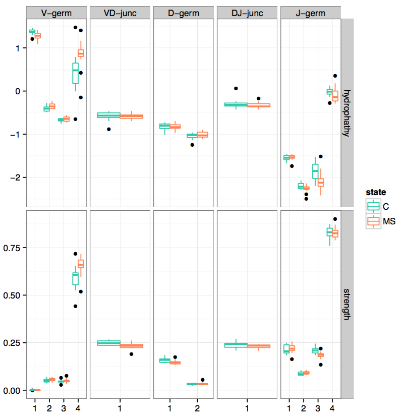

.. _annotate:

Annotation
----------

.. _CalcCdrAAProfile:

CalcCdrAAProfile
^^^^^^^^^^^^^^^^

Generates amino acid physical properties profile of CDR3. Amino acids are 
first grouped to corresponding CDR3 sub-regions and then binned by position 
within the sub-region. Amino acids in a given bin is scored according to 
its physical properties, average values of those scores are reported for each 
sample/sub-region/bin/property combination.

Command line usage
~~~~~~~~~~~~~~~~~~

.. code-block:: bash

    $VDJTOOLS CalcCdrAAProfile \
    [options] [sample1.txt sample2.txt ... if -m is not specified] output_prefix

Parameters:

+-------------+-----------------------+--------------------+----------------------------------------------------------------------------------------------------------------------------------------------------------+
| Shorthand   |      Long name        | Argument           | Description                                                                                                                                              |
+=============+=======================+====================+==========================================================================================================================================================+
| ``-m``      | ``--metadata``        | path               | Path to metadata file. See :ref:`common_params`                                                                                                          |
+-------------+-----------------------+--------------------+----------------------------------------------------------------------------------------------------------------------------------------------------------+
| ``-u``      | ``--unweighted``      |                    | If set, will not weight amino acid physical property averages by clonotype frequency. Weighing is performed by default.                                  |
+-------------+-----------------------+--------------------+----------------------------------------------------------------------------------------------------------------------------------------------------------+
| ``-p``      | ``--plot``            |                    | Turns on plotting. See :ref:`common_params`                                                                                                              |
+-------------+-----------------------+--------------------+----------------------------------------------------------------------------------------------------------------------------------------------------------+
|             | ``--plot-normalized`` |                    | Will normalize regions by the total number of AAs in them. Not recommended as longer CDR3s are inherently more self-reactive.                            |
+-------------+-----------------------+--------------------+----------------------------------------------------------------------------------------------------------------------------------------------------------+
| ``-f``      | ``--factor``          | string             | Specifies plotting factor. See :ref:`common_params`                                                                                                      |
+-------------+-----------------------+--------------------+----------------------------------------------------------------------------------------------------------------------------------------------------------+
| ``-r``      | ``--region-list``     | region1:nbins1,... | Comma-separated list of "region:bin" pairs, a CDR3 sub-region (see below) followed by the number of length bins. Default: ``V-germ:1,VJ-junc:1,J-germ:1``|
+-------------+-----------------------+--------------------+----------------------------------------------------------------------------------------------------------------------------------------------------------+
| ``-o``      | ``--property-list``   | property1,...      | List of amino acid physical properties to use, see below for allowed value. Uses `count` by default.                                                     |
+-------------+-----------------------+--------------------+----------------------------------------------------------------------------------------------------------------------------------------------------------+
|             | ``--include-cfw``     |                    | Consider first and last AAs of CDR3, which are normally conserved C and F/W. By default those are discarded.                                             |
+-------------+-----------------------+--------------------+----------------------------------------------------------------------------------------------------------------------------------------------------------+
| ``-h``      | ``--help``            |                    | Display help message                                                                                                                                     |
+-------------+-----------------------+--------------------+----------------------------------------------------------------------------------------------------------------------------------------------------------+

Supported CDR3 sub-regions:

+-----------+--------------------------------------------------------------------------+
| Name      | Description                                                              |
+===========+==========================================================================+
| CDR3-full | Complete CDR3 region                                                     |
+-----------+--------------------------------------------------------------------------+
| V-germ    | Germline part of CDR3 region corresponding to Variable segment           |
+-----------+--------------------------------------------------------------------------+
| D-germ    | Germline part of CDR3 region corresponding to Diversity segment          |
+-----------+--------------------------------------------------------------------------+
| J-germ    | Germline part of CDR3 region corresponding to Joining segment            |
+-----------+--------------------------------------------------------------------------+
| VD-junc   | Variable-Diversity segment junction, applicable when D segment is mapped |
+-----------+--------------------------------------------------------------------------+
| DJ-junc   | Diversity-Joining segment junction, applicable when D segment is mapped  |
+-----------+--------------------------------------------------------------------------+
| VJ-junc   | Variable-Joining segment junction, including D segment if it is mapped   |
+-----------+--------------------------------------------------------------------------+

Supported amino acid physical properties:

+------------+-----------------------------------------------------------+-----------------------------------------------------------------+
| Name       | Description                                               | Reference                                                       |
+============+===========================================================+=================================================================+
| strength   | Rate of amino acids with strong self antigen recognition  | `PMID:18946038 <http://www.ncbi.nlm.nih.gov/pubmed/18946038>`__ |
+------------+-----------------------------------------------------------+-----------------------------------------------------------------+
| disorder   | Intrinsic structural disorder                             | `PMID:16301309 <http://www.ncbi.nlm.nih.gov/pubmed/16301309>`__ |
+------------+-----------------------------------------------------------+-----------------------------------------------------------------+
| hydropathy | Hydropathy, according to the Kyte-Doolitle scale          | `PMID:14872534 <http://www.ncbi.nlm.nih.gov/pubmed/14872534>`__ |
+------------+-----------------------------------------------------------+-----------------------------------------------------------------+
| volume     | Amino acid volume                                         | `PMID:14872534 <http://www.ncbi.nlm.nih.gov/pubmed/14872534>`__ |
+------------+-----------------------------------------------------------+-----------------------------------------------------------------+
| polarity   | Number of polar amino acids                               | `PMID:14872534 <http://www.ncbi.nlm.nih.gov/pubmed/14872534>`__ |
+------------+-----------------------------------------------------------+-----------------------------------------------------------------+
| charge     | Total charge of amino acids                               | `PMID:14872534 <http://www.ncbi.nlm.nih.gov/pubmed/14872534>`__ |
+------------+-----------------------------------------------------------+-----------------------------------------------------------------+
| count      | Total number of amino acids                               |                                                                 |
+------------+-----------------------------------------------------------+-----------------------------------------------------------------+

.. note:: 
    
    CDR3 binning scheme is quite flexible, for example changing the default 
    ``-r V-germ:1,VJ-junc:1,J-germ:1`` to ``-r V-germ:5,VJ-junc:3,J-germ:5`` 
    means that the amino acid sequence of Variable segment part of CDR3 is split into 
    5 equally-sized bins and so on.    
    This can be changed to ``-r V-germ:5,VD-junc:1,D-germ:1,DJ-junc:1,J-germ:5`` for 
    analysis of chains that have Diversity segment (TRB, TRD, IGH).
    In case of very small average insert size (short V-J junction), one should consider 
    always using a single bin for this sub-region, ``VJ-junc:1``.
    
Tabular output
~~~~~~~~~~~~~~

A summary table with averaged amino acid property values is generated, 
suffixed ``cdr3aa.profile.[wt or unwt based on -u].txt``. The table contains 
the following columns:

+---------------+---------------------------------------------------------------------------------------------------------------+
| Column        | Description                                                                                                   |
+===============+===============================================================================================================+
| sample\_id    | Sample unique identifier                                                                                      |
+---------------+---------------------------------------------------------------------------------------------------------------+
| ...           | Sample metadata columns. See `Metadata <https://github.com/mikessh/vdjtools/wiki/Input#metadata>`__ section   |
+---------------+---------------------------------------------------------------------------------------------------------------+
| cdr3.segment  | Current CDR3 sub-region, see above                                                                            |
+---------------+---------------------------------------------------------------------------------------------------------------+
| bin           | Length bin within `cdr3.segment`                                                                              |
+---------------+---------------------------------------------------------------------------------------------------------------+
| property      | Amino acid physical property name, see above                                                                  |
+---------------+---------------------------------------------------------------------------------------------------------------+
| value         | Sum of amino acid property values in the bin, either weighted by clonotype frequency or not depending on `-u` |
+---------------+---------------------------------------------------------------------------------------------------------------+
| total         | Sum of amino acid counts in the bin, either weighted by clonotype frequency or not depending on `-u`          |
+---------------+---------------------------------------------------------------------------------------------------------------+

Graphical output
~~~~~~~~~~~~~~~~

A plot file with ``cdr3aa.profile.[wt or unwt based on -u].pdf`` suffix is generated. 
Columns and rows correspond to amino acid properties and CDR3 sub-regions. 
Values are grouped by specified factor (``-f``).

    
**Amino acid count in specified regions**. Length of germline CDR3 parts corresponding 
to V and J segments and length of random VJ junction is shown. 

.. _ScanDatabase:

ScanDatabase
^^^^^^^^^^^^

Annotates a set of samples using immune receptor database based on
V-(D)-J junction matching. By default uses
`VDJdb <https://github.com/mikessh/vdjdb>`__, which contains CDR3
sequences, Variable and Joining segments of known specificity obtained
using literature mining. This routine supports user-provided databases
and allows flexible filtering of results based on database fields. The
output of ScanDatabase includes both detailed (clonotype-wise)
annotation of samples and summary statistics. Only amino-acid CDR3
sequences are used in database querying.

Command line usage
~~~~~~~~~~~~~~~~~~

.. code-block:: bash

    $VDJTOOLS ScanDatabase \
    [options] [sample1.txt sample2.txt ... if -m is not specified] output_prefix

Parameters:

+-------------+-----------------------+------------------+-----------------------------------------------------------------------------------------------------------------------------------------------------------------------------------+
| Shorthand   |      Long name        | Argument         | Description                                                                                                                                                                       |
+=============+=======================+==================+===================================================================================================================================================================================+
| ``-m``      | ``--metadata``        | path             | Path to metadata file. See :ref:`common_params`                                                                                                                                   |
+-------------+-----------------------+------------------+-----------------------------------------------------------------------------------------------------------------------------------------------------------------------------------+
| ``-D``      | ``--database``        | path             | Path to an external database file. Will use built-in VDJdb if not specified.                                                                                                      |
+-------------+-----------------------+------------------+-----------------------------------------------------------------------------------------------------------------------------------------------------------------------------------+
| ``-d``      | ``--details``         |                  | Will provide a detailed output for each sample with annotated clonotype matches                                                                                                   |
+-------------+-----------------------+------------------+-----------------------------------------------------------------------------------------------------------------------------------------------------------------------------------+
| ``-f``      | ``--fuzzy``           |                  | Will query database allowing at most 2 substitutions, 1 deletion and 1 insertion but no more than 2 mismatches simultaneously. If not set, only exact matches will be reported    |
+-------------+-----------------------+------------------+-----------------------------------------------------------------------------------------------------------------------------------------------------------------------------------+
|             | ``--filter``          | ``expression``   | Logical pre-filter on database columns. See below                                                                                                                                 |
+-------------+-----------------------+------------------+-----------------------------------------------------------------------------------------------------------------------------------------------------------------------------------+
|             | ``--v-match``         |                  | V segment must to match                                                                                                                                                           |
+-------------+-----------------------+------------------+-----------------------------------------------------------------------------------------------------------------------------------------------------------------------------------+
|             | ``--j-match``         |                  | J segment must to match                                                                                                                                                           |
+-------------+-----------------------+------------------+-----------------------------------------------------------------------------------------------------------------------------------------------------------------------------------+
| ``-h``      | ``--help``            |                  | Display help message                                                                                                                                                              |
+-------------+-----------------------+------------------+-----------------------------------------------------------------------------------------------------------------------------------------------------------------------------------+

.. note:: 
    
    Database filter is a logical expression that contains
    reference to input table columns. Database column name references should 
    be surrounded with double underscores (``__``). Syntax supports Regex and 
    standard Java/Groovy functions such as ``.contains()``, ``.startsWith()``, 
    etc. Here are some examples:
    
    .. code-block:: groovy    
        
        __origin__=~/EBV/
        !(__origin__=~/CMV/)
        
    Note that the expression should be quoted: ``--filter "__origin__=~/HSV/"``

Tabular output
~~~~~~~~~~~~~~

A summary table suffixed ``annot.[database name].summary.txt`` is
generated. First header line marked with ``##FILTER`` contains filtering
expression that was used. The table contains the following columns:

+----------------------------------+--------------------------------------------------------------------------------------------------------------------------------------------------------------------------------------------------------------------------------------------------------------------------------------------------+
| Column                           | Description                                                                                                                                                                                                                                                                                      |
+==================================+==================================================================================================================================================================================================================================================================================================+
| sample\_id                       | Sample unique identifier                                                                                                                                                                                                                                                                         |
+----------------------------------+--------------------------------------------------------------------------------------------------------------------------------------------------------------------------------------------------------------------------------------------------------------------------------------------------+
| ...                              | Sample metadata columns. See `Metadata <https://github.com/mikessh/vdjtools/wiki/Input#metadata>`__ section                                                                                                                                                                                      |
+----------------------------------+--------------------------------------------------------------------------------------------------------------------------------------------------------------------------------------------------------------------------------------------------------------------------------------------------+
| diversity                        | Number of clonotypes in sample                                                                                                                                                                                                                                                                   |
+----------------------------------+--------------------------------------------------------------------------------------------------------------------------------------------------------------------------------------------------------------------------------------------------------------------------------------------------+
| match\_size                      | Number of matches between sample and database. In case ``--fuzzy`` mode is on, all matches will be counted. E.g. if clonotype ``a`` in the sample matches clonotypes ``A`` and ``B`` in the database and clonotype ``b`` in the sample matches clonotype B the value in this column will be 3.   |
+----------------------------------+--------------------------------------------------------------------------------------------------------------------------------------------------------------------------------------------------------------------------------------------------------------------------------------------------+
| sample\_diversity\_in\_matches   | Number of unique clonotypes in the sample that matched clonotypes from the database                                                                                                                                                                                                              |
+----------------------------------+--------------------------------------------------------------------------------------------------------------------------------------------------------------------------------------------------------------------------------------------------------------------------------------------------+
| db\_diversity\_in\_matches       | Number of unique clonotypes in the database that matched clonotypes from the sample                                                                                                                                                                                                              |
+----------------------------------+--------------------------------------------------------------------------------------------------------------------------------------------------------------------------------------------------------------------------------------------------------------------------------------------------+
| sample\_freq\_in\_matches        | Overall frequency of unique clonotypes in the sample that matched clonotypes from the database                                                                                                                                                                                                   |
+----------------------------------+--------------------------------------------------------------------------------------------------------------------------------------------------------------------------------------------------------------------------------------------------------------------------------------------------+
| mean\_matched\_clone\_size       | Geometric mean of frequency of unique clonotypes in the sample that matched clonotypes from the database                                                                                                                                                                                         |
+----------------------------------+--------------------------------------------------------------------------------------------------------------------------------------------------------------------------------------------------------------------------------------------------------------------------------------------------+

Detailed database query results will be also reported for each sample if
``-d`` is specified. Those tables are suffixed
``annot.[database name].[sample id].txt`` and contain the following
columns.

+-------------------+-----------------------------------------------------------------------+
| Column            | Description                                                           |
+===================+=======================================================================+
| score             | CDR3 sequence alignment score                                         |
+-------------------+-----------------------------------------------------------------------+
| query\_cdr3aa     | Query CDR3 amino acid sequence                                        |
+-------------------+-----------------------------------------------------------------------+
| query\_v          | Query Variable segment                                                |
+-------------------+-----------------------------------------------------------------------+
| query\_j          | Query Joining segment                                                 |
+-------------------+-----------------------------------------------------------------------+
| subject\_cdr3aa   | Subject CDR3 amino acid sequence                                      |
+-------------------+-----------------------------------------------------------------------+
| subject\_v        | Subject Variable segment                                              |
+-------------------+-----------------------------------------------------------------------+
| subject\_j        | Subject Joining segment                                               |
+-------------------+-----------------------------------------------------------------------+
| v\_match          | ``true`` if Variable segments of query and subject clonotypes match   |
+-------------------+-----------------------------------------------------------------------+
| j\_match          | ``true`` if Joining segments of query and subject clonotypes match    |
+-------------------+-----------------------------------------------------------------------+
| mismatches        | Comma-separated list of query->subject mismatches                     |
+-------------------+-----------------------------------------------------------------------+
| ...               | Database fields corresponding to subject clonotype                    |
+-------------------+-----------------------------------------------------------------------+

Graphical output
~~~~~~~~~~~~~~~~

none
